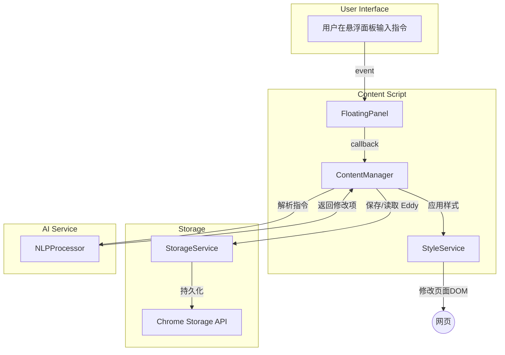

# Eddy - 网页样式编辑器

一个强大的浏览器扩展，允许用户通过自然语言自定义任何网页的样式。

## 项目结构

```
src/
├── assets/          # 静态资源文件
├── background/      # 后台脚本
├── components/      # 可复用UI组件 (如：确认对话框)
├── content/         # 内容脚本
│   ├── components/  # 面板中的UI组件
│   ├── panels/      # 悬浮面板的子模块
│   ├── services/    # 内容脚本服务
│   ├── content.ts   # 主要内容逻辑
│   ├── floatingBall.ts    # 悬浮球组件
│   └── floatingPanel.ts   # 悬浮面板组件
├── popup/          # 扩展弹出窗口
├── services/       # 核心服务
│   └── storageService.ts  # 存储服务
├── styles/         # 全局样式文件
├── types/          # 类型定义
│   ├── eddy.ts     # Eddy 相关类型
│   └── index.ts    # 通用类型定义
└── utils/          # 工具函数
    └── nlp/        # 自然语言处理
```

## 核心功能

### 1. 样式编辑
- **自然语言驱动**: 支持通过自然语言或直接CSS进行修改。
- **实时预览**: 即时应用与预览所有样式变更。
- **多元素支持**: 可同时修改多个符合条件的页面元素。

### 2. Eddy 系统 (样式集)
- **样式集管理**: 将一系列相关的样式修改保存为一个 Eddy。
- **自动命名与转换**: 在一个新页面上应用修改后，系统会自动使用用户输入为这个 Eddy 命名，并将其从临时状态转为永久保存。
- **域隔离与持久化**: 每个网站域名下可以保存多个独立的 Eddy，系统会自动应用最近使用的那个，并支持手动切换、重命名和删除。

### 3. 用户界面与体验
- **悬浮球与面板**: 提供一个可拖拽的悬浮球作为快捷入口，展开为一个集成的悬浮面板进行所有操作。
- **操作历史**: 完整的撤销（Undo）和重做（Redo）功能。
- **实时反馈**: 对用户的操作结果（如成功、失败、切换等）提供即时的UI反馈。

## 数据流

**工作流程说明:**
1.  用户通过**悬浮面板(FloatingPanel)**输入指令，触发事件。
2.  **ContentManager**接收到事件，调用**NLPProcessor**将自然语言转为具体的样式修改指令。
3.  **ContentManager**将指令交由**StyleService**应用到网页上。
4.  **核心流程**: 如果这是一个临时的 Eddy，**ContentManager**会在保存时，根据用户的指令**自动为 Eddy 命名**，并通过**StorageService**将其保存为永久 Eddy。
5.  所有 Eddy 数据最终通过**StorageService**持久化到**Chrome Storage**中。

## 技术栈

- **核心**: TypeScript, Chrome Extension API
- **构建**: Webpack
- **代码规范**: ESLint + Prettier
- **测试**: Jest

## 未来计划

- [ ] **样式市场**: 允许用户分享和下载样式模板。
- [ ] **跨设备同步**: 通过 Chrome Sync 在不同设备间同步 Eddy。
- [ ] **增强的UI**: 使用现代前端框架（如 React）重构UI，提供更丰富的交互。
- [ ] **协作编辑**: 允许多个用户在同一个页面上协作编辑样式。
- [ ] **高级版本控制**: 为 Eddy 提供类似 Git 的分支和历史管理功能。

## 项目概述
PageEdit 是一个创新的浏览器工具，允许用户通过自然语言描述来实时修改网页的布局和样式。用户可以简单地说"把背景改成蓝色"或"让这个按钮更大一些"，工具就会自动应用相应的CSS修改。

## 核心功能
- 🗣️ **自然语言解析** - 理解用户的样式修改意图
- 🎨 **实时样式修改** - 即时应用CSS变更到网页
- 🔍 **智能元素识别** - 自动识别用户想要修改的页面元素
- 💾 **样式持久化** - 保存用户的自定义样式
- 🔄 **撤销/重做** - 支持操作历史管理
- 🎯 **多元素修改** - 支持同时修改多个元素
- 🔒 **安全验证** - 确保修改的安全性
- 📊 **修改历史** - 记录所有修改操作
- 📝 **草稿系统** - 自动保存用户输入，智能恢复草稿内容

## 技术架构

### 核心组件
```
PageEdit/
├── manifest.json           # 插件配置文件
├── popup/                  # 弹出窗口
│   ├── popup.html         # 用户界面
│   ├── popup.css          # 样式
│   └── popup.js           # 弹出窗口逻辑
├── content/               # 内容脚本
│   ├── content.js        # 与网页交互
│   └── content.css       # 注入样式
├── background/           # 后台脚本
│   └── background.js    # 后台逻辑
├── utils/               # 工具类
│   ├── dom/            # DOM 操作工具
│   │   ├── elementLocator.ts    # 元素定位工具
│   │   ├── styleModifier.ts     # 样式修改工具
│   │   └── elementFinder.ts     # 元素查找工具
│   ├── storage/        # 存储相关工具
│   │   └── storageManager.ts    # 存储管理工具
│   ├── nlp/            # 自然语言处理工具
│   │   └── llmService.ts        # LLM 服务工具
│   └── validation/     # 数据验证工具
│       └── validator.ts         # 数据验证工具
└── assets/              # 静态资源
    └── icons/          # 图标资源
```

### 技术栈
- **前端**: Chrome Extension (原生JavaScript/TypeScript)
- **AI模型**: 自然语言处理 + CSS生成
- **存储**: Chrome Storage API
- **开发工具**: VS Code, Chrome DevTools
- **版本控制**: Git
- **构建工具**: Webpack
- **代码规范**: ESLint + Prettier
- **测试框架**: Jest

### 组件职责
1. **Popup组件**
   - 用户输入界面
   - 显示当前页面信息
   - 提供编辑选项
   - 显示修改历史
   - 管理用户设置
   - 提供操作反馈

2. **Content Script**
   - 监听页面DOM变化
   - 执行样式修改
   - 处理元素定位
   - 注入自定义样式
   - 管理修改历史
   - 处理页面交互
   - **草稿管理**：自动保存和恢复用户输入内容

3. **Background Script**
   - 管理插件状态
   - 处理数据存储
   - 处理跨域请求
   - 管理插件生命周期
   - 处理消息通信
   - 管理权限

4. **Utils 工具类**
   - DOM 操作工具：元素定位、样式修改、元素查找
   - 存储工具：数据持久化、状态管理
   - NLP 工具：自然语言处理、LLM 服务
   - 验证工具：数据验证、安全检查
   - **草稿工具**：草稿保存、加载、防抖机制

### 数据流
```
用户输入 → Popup → Content Script → Utils工具类 → 页面修改
                    ↓
              Background Script
                    ↓
              Chrome Storage
                    ↓
              草稿系统 (自动保存/恢复)
```

### 详细数据流说明
1. **用户交互流程**
   ```
   用户输入 → Popup界面
   ↓
   Content Script接收指令
   ↓
   Utils工具类处理
   ├── DOM工具：元素定位和样式修改
   ├── NLP工具：自然语言处理
   ├── 验证工具：安全检查
   ├── 存储工具：状态管理
   └── 草稿工具：自动保存用户输入
   ↓
   应用修改到页面
   ```

2. **数据存储流程**
   ```
   Background Script
   ↓
   存储工具(Utils/storage)
   ↓
   Chrome Storage
   ↓
   草稿系统 (Eddy.draftContent)
   ```

3. **状态同步流程**
   ```
   Content Script ←→ Background Script
        ↓              ↓
   Utils工具类 ←→ Chrome Storage
        ↓              ↓
   草稿系统 ←→ Eddy 草稿内容
   ```

4. **草稿系统流程**
   ```
   用户输入 → 防抖机制 → 保存草稿到 Eddy
        ↓
   切换 Eddy → 加载对应草稿 → 恢复输入内容
        ↓
   应用修改 → 立即保存草稿 → 更新 Eddy 状态
   ```

## 使用场景
1. **个性化浏览体验** - 用户可以根据喜好调整任何网站的外观
2. **无障碍访问** - 帮助视觉障碍用户调整页面以提高可读性
3. **设计原型** - 设计师可以快速测试不同的样式方案
4. **学习工具** - 帮助学习者理解CSS和网页设计
5. **开发调试** - 开发者可以快速测试不同的样式效果
6. **内容定制** - 用户可以自定义网站内容的展示方式
7. **草稿管理** - 用户可以保存多个编辑草稿，随时切换和恢复

## 开发计划
- [ ] 基础浏览器扩展框架
  - [ ] 创建manifest.json
  - [ ] 设置基本图标
  - [ ] 配置popup页面
  - [ ] 配置权限
- [ ] 用户界面
  - [ ] 设计popup界面
  - [ ] 实现用户输入
  - [ ] 添加基本样式
  - [ ] 实现响应式设计
- [ ] 核心功能
  - [ ] 实现DOM操作
  - [ ] 添加样式修改
  - [ ] 实现元素定位
  - [ ] 实现多元素修改
- [ ] 高级功能
  - [ ] 自然语言处理
  - [ ] 修改历史
  - [ ] 用户设置
  - [ ] 导入导出
- [ ] 草稿系统
  - [x] 基础草稿功能
  - [ ] 草稿版本管理
  - [ ] 草稿同步功能
  - [ ] 草稿清理机制

## 快速开始
```bash
# 克隆项目
git clone <repository-url>

# 安装依赖
npm install

# 开发模式
npm run dev

# 构建扩展
npm run build

# 运行测试
npm test

# 代码检查
npm run lint
```

## 安全考虑
- 内容安全策略(CSP)
- 跨域请求处理
- 数据验证
- 错误处理
- 权限管理
- 输入验证
- XSS防护
- 数据加密

## 性能优化
- 延迟加载
- 缓存机制
- 批量DOM操作
- 防抖和节流
- 资源压缩
- 代码分割
- 按需加载
- 性能监控

## 贡献
欢迎提交 Issues 和 Pull Requests！

### 贡献指南
1. Fork 项目
2. 创建特性分支
3. 提交更改
4. 推送到分支
5. 创建 Pull Request

### 开发规范
- 遵循 TypeScript 规范
- 使用 ESLint 进行代码检查
- 编写单元测试
- 保持代码文档更新

## 许可证
MIT License

## 联系方式
- 项目主页：[GitHub Repository]
- 问题反馈：[Issues]
- 邮件联系：[Email]
