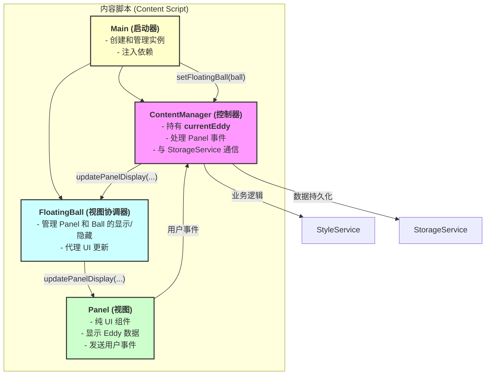
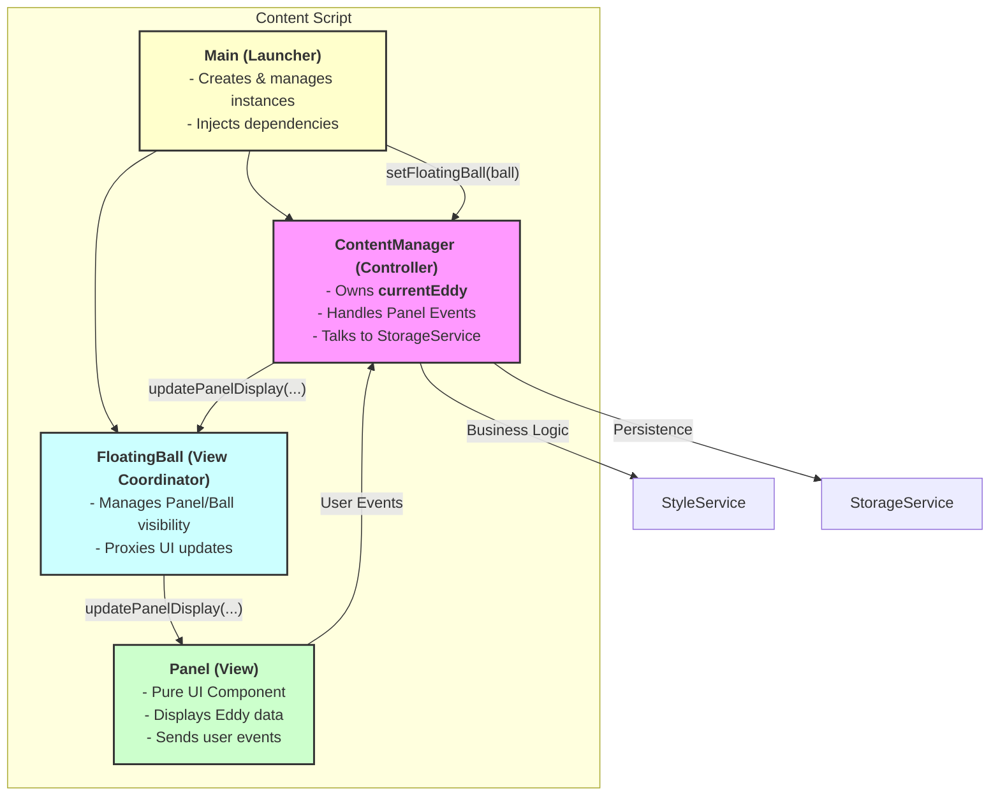

# Refactoring Plan: Content Script Architecture
## 中文版本

### 1. 目标

重构内容脚本（Content Script）的架构，以实现清晰的职责分离、健壮的状态管理和可预测的单向数据流。这将使代码库更易于维护、扩展和调试。

### 2. 核心问题

当前架构中，不同组件的职责是模糊的：
- **状态位置不当**：关键业务状态，特别是 `currentEddy`，被放在了 UI 层（`FloatingBall`/`Panel`）进行管理。
- **高度耦合**：`ContentManager`（逻辑层）被迫深入 `Panel`（视图层）来访问和操作状态，造成了紧密且反向的依赖。
- **数据流不清晰**：很难追踪状态变更是如何在系统中传递的，这可能导致潜在的错误，并使新功能的开发变得复杂。
- **初始化脆弱**：组件（如 `ContentManager` 和 `FloatingBall`）的实例化顺序和它们之间的依赖关系没有被严格管理，依赖于全局 `window` 对象和 `setTimeout`，这可能导致竞态条件和不可靠的行为。

### 3. 推荐架构

我们将实现一个分层清晰的架构，其中每个组件都有单一、明确的职责。



- **Main**: 一个单例启动器，确保 `ContentManager` 和 `FloatingBall` 的正确实例化和依赖注入。
- **ContentManager**：作为中央控制器。它持有顶层状态（`currentEddy`）并协调所有操作。
- **FloatingBall**: 视图的协调器，管理 `Panel` 的可见性，并将来自 `ContentManager` 的 UI 更新请求代理给 `Panel`。
- **Panel**：一个"哑"视图组件，只负责展示给它的数据并发出用户事件。
- **StyleService**：一个专门的"引擎"，负责管理底层的、内存中的样式状态（`globalState`）并执行 DOM 操作。

### 4. 可执行的重构步骤

#### 步骤 1: 将 `currentEddy` 状态集中到 `ContentManager`

**目标**：将 `currentEddy` 的所有权从 `Panel` 迁移到 `ContentManager`。

1.  **修改 `ContentManager` (`src/content/content.ts`)**:
    -   添加一个私有字段来持有当前的 Eddy 状态。
    ```typescript
    export class ContentManager {
        private currentEddy: Eddy | null = null;
        // ... 其他类成员
    }
    ```
2.  **修改 `FloatingBall` 和 `Panel`**:
    -   从 `Panel` 和/或 `FloatingBall` 类中移除 `currentEddy` 字段。
3.  **更新访问模式**:
    -   全局搜索所有 `floatingBall.panel.currentEddy` 的实例。
    -   将它们替换为在 `ContentManager` 类中直接访问 `this.currentEddy`。
    -   `ContentManager` 现在将负责把必要的数据（例如 `currentEddy.name`）传递给 `FloatingBall`，再由其传递给 `Panel` 进行渲染。

#### 步骤 2: 巩固 `ContentManager` 作为逻辑控制器

**目标**：确保所有的业务逻辑和数据持久化都由 `ContentManager` 独家处理。

1.  **创建一个集中的保存方法**:
    -   在 `ContentManager` 内部实现一个统一的 `saveCurrentEddyToStorage()` 方法。
    ```typescript
    // 在 src/content/content.ts 的 ContentManager 类中
    private async saveCurrentEddyToStorage(): Promise<void> {
        if (!this.currentEddy) {
            console.warn("没有需要保存的 Eddy。");
            return;
        }
        const updatedEddy = StyleService.updateGlobalStateToEddy(this.currentEddy);
        this.currentEddy = updatedEddy;
        await this.saveEddyToStorage(this.currentEddy);
    }
    ```
2.  **集成保存方法**:
    -   在每个导致状态变更的方法末尾调用 `this.saveCurrentEddyToStorage()`，例如在 `undoLastModification()`、`redoLastModification()`、`handleModifyPage()` 等方法中。

#### 步骤 3: 将 `Panel` 简化为纯 UI 组件

**目标**：剥离 `Panel` 的任何状态管理职责，并通过 `FloatingBall` 进行通信。

1.  **数据驱动的 UI 更新**:
    -   在 `Panel` 上创建明确的方法来更新其视图，这些方法将由 `FloatingBall` 调用，而 `FloatingBall` 的方法则由 `ContentManager` 调用。
    -   关键方法是 `updatePanelDisplay`，它取代了旧的 `setCurrentEddy`。
    ```typescript
    // 在 FloatingPanel 类 (src/content/floatingPanel.ts) 中
    public updatePanelDisplay(eddyName: string, eddyId: string, isNew: boolean): void {
        // 更新标题
        this.updateEddyTitle(eddyName); 
        // 更新下拉菜单
        PanelEvents.updateDropdown(eddyId);
        // ... 更新其他UI元素
    }

    // 在 FloatingBall 类 (src/content/floatingBall.ts) 中
    public updatePanelDisplay(name: string, id: string, isNew: boolean): void {
        this.panel.updatePanelDisplay(name, id, isNew);
    }
    ```
2.  **重构 `ContentManager` 以调用 Panel 更新方法**:
    -   在加载 Eddy 或改变状态后，`ContentManager` 应调用 `floatingBall` 的方法以保持 UI 同步。
    ```typescript
    // 在 ContentManager 的 handleSwitchEddy 方法中
    if (this.floatingBall && this.currentEddy) {
        this.floatingBall.updatePanelDisplay(this.currentEddy.name, this.currentEddy.id, false);
        this.floatingBall.updateUndoRedoButtonStates();
    }
    ```

#### 步骤 4: 验证 `StyleService` 的封装性

**目标**：确认 `StyleService` 作为一个完全封装的引擎在工作。

1.  **检查 `private static globalState`**:
    -   确保 `globalState` 是一个 `private static` 字段，并且没有从 `StyleService` 类外部访问它。
2.  **审查公共 API**:
    -   `StyleService` 的公共 API 应该是高层次和面向操作的（例如 `undo()`, `redo()`, `applyModification(...)`）。它不应直接暴露其内部的 `globalState` 对象。

#### 步骤 5: 重构初始化流程与依赖注入

**目标**: 建立一个稳固的、可预测的组件初始化流程，消除对全局变量和 `setTimeout` 的依赖。

1.  **创建 `Main` 单例类**:
    -   在 `content.ts` 底部，创建一个 `Main` 类来管理 `ContentManager` 和 `FloatingBall` 的生命周期。
    ```typescript
    // 在 src/content/content.ts 中
    class Main {
        private static instance: Main;
        private contentManager: ContentManager;
        private floatingBall: FloatingBall;

        private constructor() {
            this.contentManager = new ContentManager();
            this.floatingBall = new FloatingBall();
            // ... 依赖注入和事件绑定 ...
        }

        public static getInstance(): Main {
            if (!Main.instance) {
                Main.instance = new Main();
            }
            return Main.instance;
        }
    }
    ```
2.  **实现依赖注入**:
    -   `ContentManager` 需要一个对 `FloatingBall` 的引用来更新 UI。通过一个 `setter` 方法将 `FloatingBall` 实例注入到 `ContentManager` 中，而不是让 `ContentManager` 自己去寻找它。
    ```typescript
    // 在 ContentManager 类中
    public setFloatingBall(ball: FloatingBall): void {
        this.floatingBall = ball;
    }

    // 在 Main 类的构造函数中
    this.contentManager.setFloatingBall(this.floatingBall);
    ```
3.  **连接事件流**:
    -   在 `Main` 类中，将 `Panel` 发出的事件绑定到 `ContentManager` 的处理器上。
    ```typescript
    // 在 Main 类的构造函数中
    this.floatingBall.setPanelEventCallback(
        this.contentManager.handlePanelEvent.bind(this.contentManager)
    );
    ```
4.  **安全的启动点**:
    -   使用 `DOMContentLoaded` 事件来确保在 DOM 准备就绪时才开始初始化，从而避免竞争条件。

### 5. 预期成果

- **所有权清晰**：`ContentManager` 持有 `currentEddy`。`StyleService` 持有 `globalState`。`Panel` 只持有它自己的 DOM 元素。
- **可预测的数据流**：操作流向 `Panel` -> `ContentManager` -> `StyleService`。状态更新流向 `ContentManager` -> `FloatingBall` -> `Panel`。
- **可维护性提高**：添加新功能（如"克隆 Eddy"按钮）会变得简单得多，因为修改点很清晰。
- **可测试性增强**：每个组件都可以更容易地被独立测试。
- **初始化稳健**：通过依赖注入和单例启动器，消除了初始化过程中的不确定性。

---

## English Version

## 1. Goal

To refactor the content script architecture for a clear separation of concerns, robust state management, and a predictable unidirectional data flow. This will make the codebase more maintainable, scalable, and easier to debug.

## 2. Core Problem

Currently, the responsibilities are blurred across different components:
- **State Misplacement**: Critical business state, specifically `currentEddy`, is managed within the UI layer (`FloatingBall`/`Panel`).
- **High Coupling**: The `ContentManager` (logic layer) is forced to reach into the `Panel` (view layer) to access and manipulate state, creating a tight and inverted dependency.
- **Unclear Data Flow**: It's difficult to track how state changes propagate through the system, leading to potential bugs and making new feature development complex.
- **Fragile Initialization**: The instantiation order of components (like `ContentManager` and `FloatingBall`) and their dependencies are not strictly managed, relying on the global `window` object and `setTimeout`, which can lead to race conditions and unreliable behavior.

## 3. Proposed Architecture

We will implement a clean, layered architecture where each component has a single, well-defined responsibility.



- **Main**: A singleton launcher that ensures correct instantiation and dependency injection for `ContentManager` and `FloatingBall`.
- **ContentManager**: The central controller. It owns the high-level state (`currentEddy`) and orchestrates all operations.
- **FloatingBall**: The view coordinator, managing the `Panel`'s visibility and proxying UI update requests from the `ContentManager` to the `Panel`.
- **Panel**: A "dumb" view component that displays data it's given and emits user events.
- **StyleService**: A specialized "engine" that manages the low-level, in-memory style state (`globalState`) and executes DOM manipulations.

## 4. Actionable Refactoring Steps

### Step 1: Centralize `currentEddy` State in `ContentManager`

**Objective**: Move the ownership of `currentEddy` from the `Panel` to the `ContentManager`.

1.  **Modify `ContentManager` (`src/content/content.ts`):**
    -   Add a private field to hold the current Eddy state.
    ```typescript
    export class ContentManager {
        private currentEddy: Eddy | null = null;
        // ... rest of the class
    }
    ```
2.  **Modify `FloatingBall` and `Panel`:**
    -   Remove the `currentEddy` field from the `Panel` and/or `FloatingBall` class.
3.  **Update Access Patterns:**
    -   Globally search for all instances of `floatingBall.panel.currentEddy`.
    -   Replace them with direct access to `this.currentEddy` within the `ContentManager` class.
    -   The `ContentManager` will now be responsible for passing the necessary data (e.g., `currentEddy.name`) to the `FloatingBall`, which in turn passes it to the `Panel` for rendering.

### Step 2: Solidify `ContentManager` as the Logic Controller

**Objective**: Ensure all business logic and state persistence is handled exclusively by `ContentManager`.

1.  **Create a Central Save Method:**
    -   Implement a unified `saveCurrentEddyToStorage()` method inside `ContentManager`.
    ```typescript
    // In src/content/content.ts within ContentManager class
    private async saveCurrentEddyToStorage(): Promise<void> {
        if (!this.currentEddy) {
            console.warn("No current Eddy to save.");
            return;
        }
        const updatedEddy = StyleService.updateGlobalStateToEddy(this.currentEddy);
        this.currentEddy = updatedEddy;
        await this.saveEddyToStorage(this.currentEddy);
    }
    ```
2.  **Integrate Save Method**:
    -   Call `this.saveCurrentEddyToStorage()` at the end of every method that results in a state change, such as `undoLastModification()`, `redoLastModification()`, and `handleModifyPage()`.

### Step 3: Simplify `Panel` to a Pure UI Component

**Objective**: Strip the `Panel` of any state management responsibilities and have it communicate via `FloatingBall`.

1.  **Data-Driven UI Updates**:
    -   Create explicit methods on the `Panel` to update its view, which are called by `FloatingBall`, whose methods are in turn called by `ContentManager`.
    -   The key method is `updatePanelDisplay`, which replaces the old `setCurrentEddy`.
    ```typescript
    // In FloatingPanel class (src/content/floatingPanel.ts)
    public updatePanelDisplay(eddyName: string, eddyId: string, isNew: boolean): void {
        // Update title
        this.updateEddyTitle(eddyName); 
        // Update dropdown
        PanelEvents.updateDropdown(eddyId);
        // ... update other UI elements
    }

    // In FloatingBall class (src/content/floatingBall.ts)
    public updatePanelDisplay(name: string, id: string, isNew: boolean): void {
        this.panel.updatePanelDisplay(name, id, isNew);
    }
    ```
2.  **Refactor `ContentManager` to Call Panel Update Methods**:
    -   After loading an Eddy or changing state, `ContentManager` should call the `floatingBall`'s methods to keep the UI in sync.
    ```typescript
    // In ContentManager's handleSwitchEddy method
    if (this.floatingBall && this.currentEddy) {
        this.floatingBall.updatePanelDisplay(this.currentEddy.name, this.currentEddy.id, false);
        this.floatingBall.updateUndoRedoButtonStates();
    }
    ```

### Step 4: Validate `StyleService` Encapsulation

**Objective**: Confirm that `StyleService` is working as a fully encapsulated engine.

1.  **Check `private static globalState`**:
    -   Ensure `globalState` is a `private static` field and is not accessed from outside the `StyleService` class.
2.  **Review Public API**:
    -   The public API of `StyleService` should be high-level and action-oriented (e.g., `undo()`, `redo()`, `applyModification(...)`). It should not expose its internal `globalState` object directly.

### Step 5: Refactor Initialization and Dependency Injection

**Objective**: Establish a robust and predictable component initialization flow, eliminating reliance on global variables and `setTimeout`.

1.  **Create `Main` Singleton Class**:
    -   At the bottom of `content.ts`, create a `Main` class to manage the lifecycle of `ContentManager` and `FloatingBall`.
    ```typescript
    // In src/content/content.ts
    class Main {
        private static instance: Main;
        private contentManager: ContentManager;
        private floatingBall: FloatingBall;

        private constructor() {
            this.contentManager = new ContentManager();
            this.floatingBall = new FloatingBall();
            // ... dependency injection and event binding ...
        }

        public static getInstance(): Main {
            if (!Main.instance) {
                Main.instance = new Main();
            }
            return Main.instance;
        }
    }
    ```
2.  **Implement Dependency Injection**:
    -   The `ContentManager` needs a reference to the `FloatingBall` to update the UI. "Inject" the `FloatingBall` instance into `ContentManager` via a setter method, rather than having `ContentManager` find it itself.
    ```typescript
    // In ContentManager class
    public setFloatingBall(ball: FloatingBall): void {
        this.floatingBall = ball;
    }

    // In Main class's constructor
    this.contentManager.setFloatingBall(this.floatingBall);
    ```
3.  **Wire Up Event Flow**:
    -   In the `Main` class, bind the events emitted from the `Panel` to the `ContentManager`'s handlers.
    ```typescript
    // In Main class's constructor
    this.floatingBall.setPanelEventCallback(
        this.contentManager.handlePanelEvent.bind(this.contentManager)
    );
    ```
4.  **Safe Entry Point**:
    -   Use the `DOMContentLoaded` event to ensure initialization only begins when the DOM is ready, preventing race conditions.

### 5. Expected Outcome

- **Clear Ownership**: `ContentManager` owns `currentEddy`. `StyleService` owns `globalState`. `Panel` owns nothing but its DOM elements.
- **Predictable Data Flow**: Actions flow from `Panel` -> `ContentManager` -> `StyleService`. State updates flow from `ContentManager` -> `FloatingBall` -> `Panel`.
- **Improved Maintainability**: Adding a new feature (like a "Clone Eddy" button) becomes much simpler as the points of modification are clear.
- **Enhanced Testability**: Each component can be more easily tested in isolation.
- **Robust Initialization**: Uncertainty in the initialization process is eliminated through dependency injection and a singleton launcher.

</rewritten_file> 